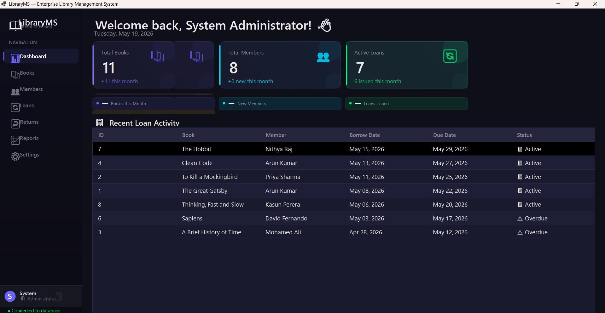
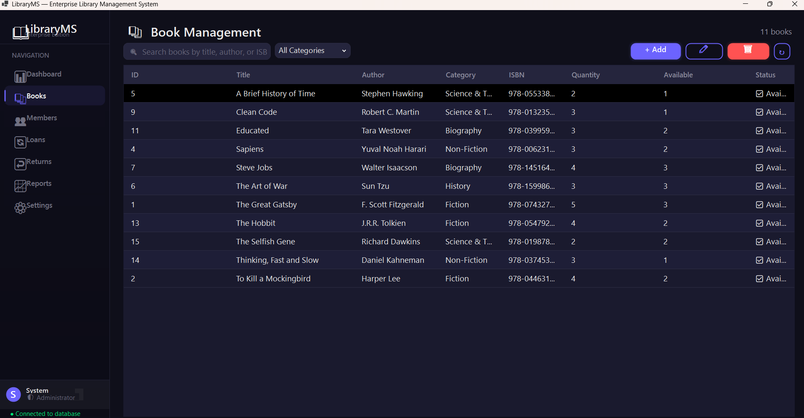
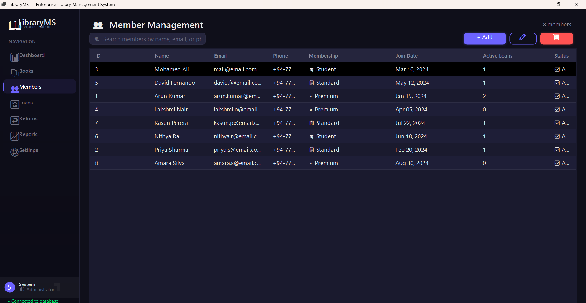
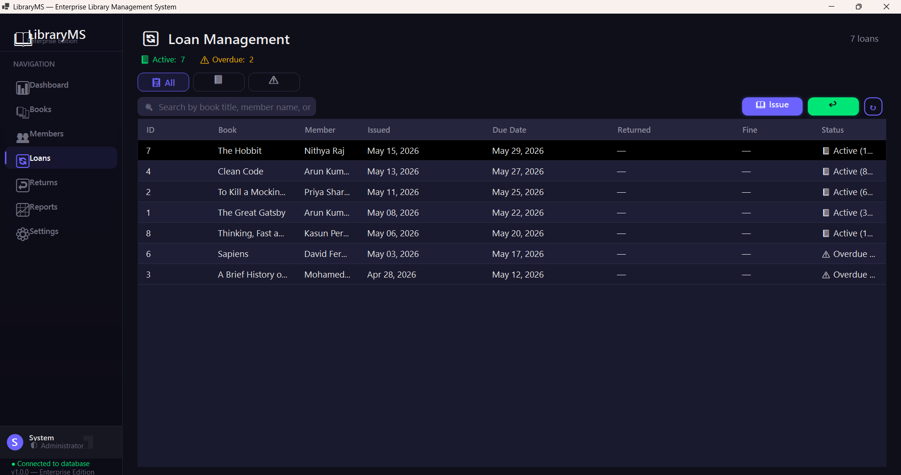
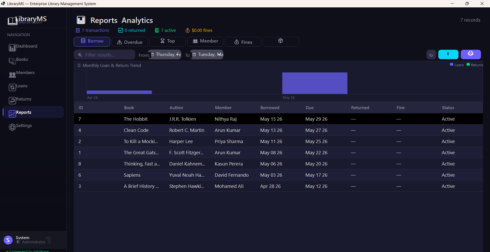

# Enterprise Library Management System

A premium enterprise-level desktop Library Management System built using C#, .NET 8, WinForms, SQL Server, Dapper, and Guna UI2.

## Features

- Authentication & Security
- Book Management
- Member Management
- Loan / Issue System
- Return & Fine System
- Reports & Analytics
- Export to PDF/Excel
- Premium Dashboard
- Enterprise UI/UX

## Tech Stack

- C#
- .NET 8
- WinForms
- SQL Server
- Dapper
- Guna UI2
- Layered Architecture

## Author

Mohamed Uzmaan
## Screenshots

### Login

### Dashboard

### Books

### Members

### Loans

### Reports
